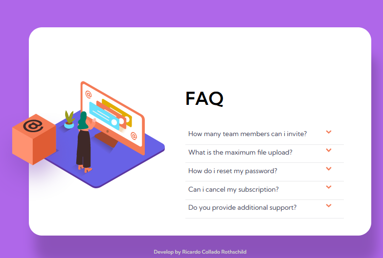

# Frontend Mentor - FAQ accordion card solution

## Table of contents

- [Overview](#overview)
  - [The challenge](#the-challenge)
  - [Screenshot](#screenshot)
  - [Links](#links)
- [My process](#my-process)
  - [Built with](#built-with)
  - [What I learned](#what-i-learned)
  - [Continued development](#continued-development)
- [Author](#author)
- [Acknowledgments](#acknowledgments)


## Overview

### The challenge

Users should be able to:

- View the optimal layout for the component depending on their device's screen size
- See hover states for all interactive elements on the page
- Hide/Show the answer to a question when the question is clicked



### Links

- Solution URL: https://github.com/RicardoColladoRothschild/FQAComponent.github.io.git
- Live Site URL: https://ricardocolladorothschild.github.io/FQAComponent.github.io/

## My process

### Built with

- Semantic HTML5 markup
 I use appropiate tag names for the section that i was working, to keep a semantic html
- Sass
I implemented Sass during this solution to keep the code as clean as possible and to practice some knowled. Basic use of variables and som Mixin
- Flexbox
I considered flexbox one of the best way possible to adjust the elements on the screen when working with a mobile first design, It helps to keep it simple when start to work with the media queries. 
- Mobile-first workflow
Designing thinking on mobile first, has been a pattern on all my web designs, since i considered the scalability to be easier this way.

### What I learned

During this work i focus on DOM, and apply my knowledge to it. You might find that i put all the code together on the same js file, this was too keep it simple. even thought some functions might have fix better putting it in an outter class, and then use a constructor.

On JavaScript i found very intresting the fact that the querySelectorAll() method actually return an object, so i found a way to take that as an array; that way it was way simple to track the specific element that i need to work with.

For example:

```js
const arrowsElements = document.querySelectorAll('.arrow');
const elementsAsArray = Array.from(arrowsElements);
```

Yo can see how i take the objects and put it into an array, so i can handle it by index.

### Continued development

Next step with other projects i will implement more Oriented Object Programming, so i can clean my code as possible.
Creating class structure, and implement functions for specific task.

## Author
Name Ricardo Collado Rothschild
- LinkedIn - https://www.linkedin.com/in/ricardovladimircolladorothschild/
- Github - https://github.com/RicardoColladoRothschild

## Acknowledgments
Always to my wife. 